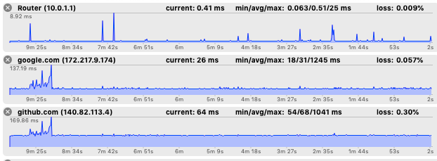

# Ping Tools in macOS

I was looking for an outbound ping tool that I could run continuously on a secondary monitor or in the background so I could quickly troubleshoot internet outages or packet loss.

For example, when I'm in a video call, if the other person starts to have issues with audio/video, I can, with a glance, tell if it's me or not by looking for latency/packet loss amongst the hosts I'm pinging.

**[ICMPUtil][1] is the best I've found.** It's $6 [on the App Store][2].

I recommend setting it to use a **1 second ping interval with a 64 byte payload**. 0.1 second pings look cool but many servers including google.com won't respond to ICMP that quickly. The default payload of 32 bytes is half the default value for a typical ping command so results may differ slightly if you don't use 64 bytes.

Add several hosts so if there's an outage with your internet, you'll see all hosts aren't responding. If there's just an issue with say Google or AWS then multiple hosts could fail but it's not your internet.

## Other Tools

Some other options:

[mtr][3] - This is a traceroute terminal app that continually pings each host in a traceroute
[autoping][4] - GUI mac app I used to use; no longer available though

[1]:	http://www.ermitacode.com/icmputil.html "ICMPUtil"
[2]:	https://apps.apple.com/us/app/icmputil/id866965011?mt=12 "on the App Store"
[3]:	https://formulae.brew.sh/formula/mtr "mtr"
[4]:	https://sixcolors.com/post/2015/02/autoping-keeps-an-eye-on-my-network/ "autoping"
