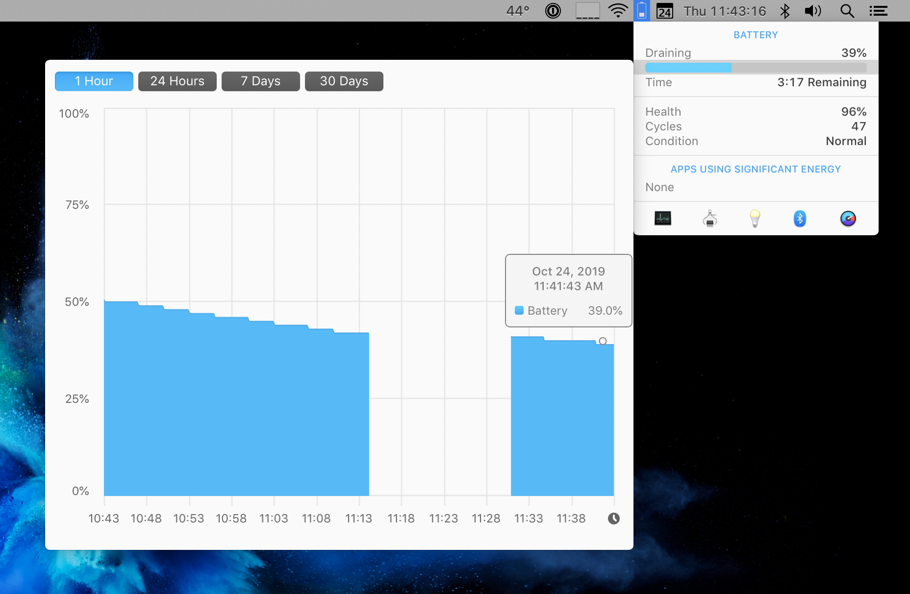

# MacBook Pro Battery Drain

My main computer is my iMac. It seemed like every time I opened my MacBook Pro it would show this screen:

So I researched a bit and fixed it. Here's what I did:

* **Turn off "PowerNap while on battery power"**. This is the Energy preference pane.
* **Turn off "Allow Bluetooth devices to wake this computer"**. This is in the Bluetooth preference pane under Advanced.

Now, when I open my MacBook the battery has barely moved from the previous day. For example, 3 days ago I closed my laptop with 64% battery. I opened it this morning with 50% battery. A 5%/day battery drain is excellent for a computer that's keeping its running memory actively powered. Previously I'd see what seemed to be 5%/hour (I didn't actually measure it but rarely did I open my laptop and it wasn't dead). 

If you want to track your battery usage, check out [iStat Menus](https://bjango.com/mac/istatmenus/). It has a graph to show battery drain over time (past hour, day, week, month).

